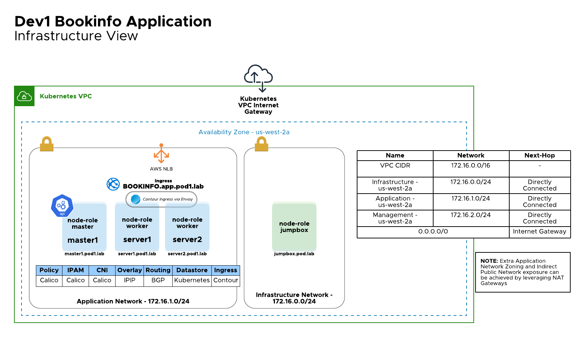
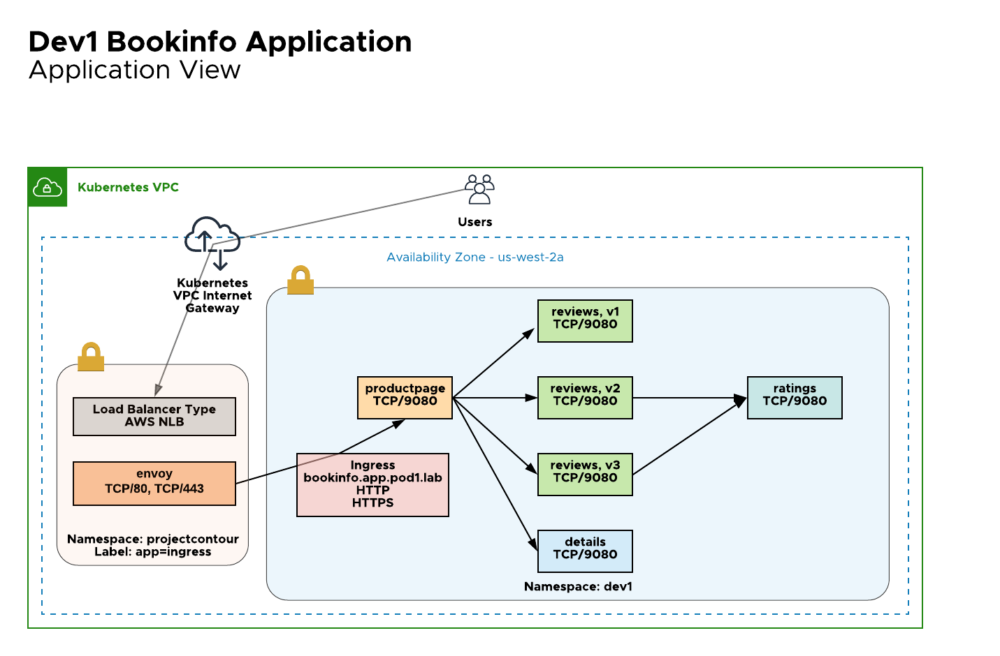
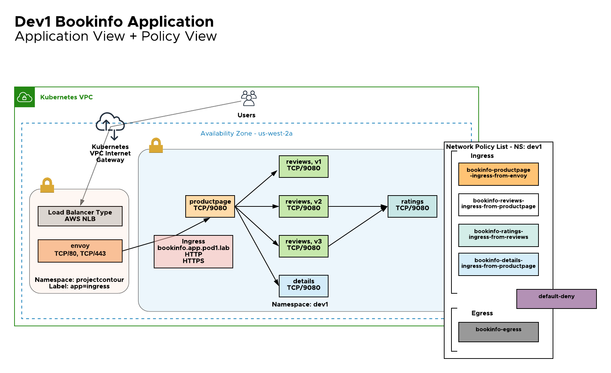

# refactored-spork
Securing Dev1 Bookinfo App leveraging Project Calico
# Overview
The repository is terraform plan that includes:
1. Build out of self-managed Kubernetes cluster on top of AWS with Project Calico as CNI and Project Contour as Ingress Controller
2. Install of bookinfo app [https://istio.io/latest/docs/examples/bookinfo/]
3. Securing bookinfo app leveraging Project Calico Network Policies
4. Configuration management is performed by Ansible
# Prerequisites
1. Terraform >= 0.12.x
2. Ansible >= 2.9.x
3. AWS
# Topology



# HowTo
 1. Clone the repository
```
root@avitools:~# git clone https://github.com/smarunich/refactored-spork
Cloning into 'refactored-spork'...
remote: Enumerating objects: 578, done.
remote: Counting objects: 100% (578/578), done.
remote: Compressing objects: 100% (392/392), done.
remote: Total 578 (delta 206), reused 459 (delta 87), pack-reused 0
Receiving objects: 100% (578/578), 60.98 KiB | 1.27 MiB/s, done.
Resolving deltas: 100% (206/206), done.
```
2. Generate and apply terraform plan
Note: Only us-west-2 AMIs are provided, for any other AWS regions AMIs have to be supplied
```
terraform apply
var.aws_access_key
  Enter a value: ######

var.aws_region
  Enter a value: us-west-2

var.aws_secret_key
  Enter a value: ######
```
3. Access the environment details
```
Jumpbox_PublicIP = 54.149.125.171
Master_PublicIP = [
  "54.188.241.136",
]
```
4. Access the jumpbox leveraging self-generated key located in "keys" folder
```
ssh -i keys/generated-access-key-raccoon.pem 54.149.125.171 -l ubuntu
ubuntu@jumpbox:~$ cat /etc/hosts
172.20.0.234	jumpbox.pod.lab
54.149.125.171	public.jumpbox.pod.lab
172.20.1.232	server2.pod1.lab
52.37.178.129	public.server2.pod1.lab
172.20.1.122	server1.pod1.lab
54.202.216.17	public.server1.pod1.lab
172.20.1.145	master1.pod1.lab
54.188.241.136	public.master1.pod1.lab
kubuntu@ip-172-20-1-145:~$ kubectl get nodes
NAME                                         STATUS   ROLES    AGE   VERSION
ip-172-20-1-122.us-west-2.compute.internal   Ready    worker   15h   v1.19.3
ip-172-20-1-145.us-west-2.compute.internal   Ready    master   16h   v1.19.3
ip-172-20-1-232.us-west-2.compute.internal   Ready    worker   15h   v1.19.3
ubuntu@ip-172-20-1-145:~$ ls
bookinfo-ingress.yaml  bookinfo-policy-networking.k8s.io.yaml  bookinfo-policy-projectcalico.org.yaml  kubeadm.yaml
ubuntu@ip-172-20-1-145:~$ calicoctl get policy -n dev1
NAMESPACE   NAME
dev1        knp.default.bookinfo-details-ingress-from-productpage
dev1        knp.default.bookinfo-egress
dev1        knp.default.bookinfo-productpage-ingress-from-envoy
dev1        knp.default.bookinfo-ratings-ingress-from-reviews
dev1        knp.default.bookinfo-reviews-ingress-from-productpage
dev1        knp.default.default-deny-ingress
```

# FAQ
1. It can be the case when the provision process can take a longer time and the worker nodes will not be associated with the cluster. Run the following command from the jumpbox to re-trigger nodes to join:
```
ubuntu@jumpbox:~$ ansible-playbook /opt/bootstrap/project/bootstrap.yml --limit servers
```
